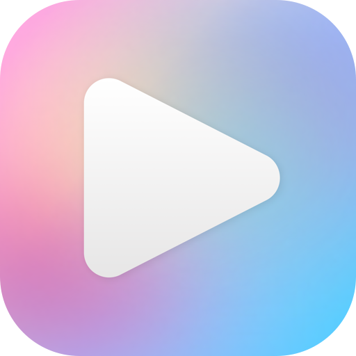
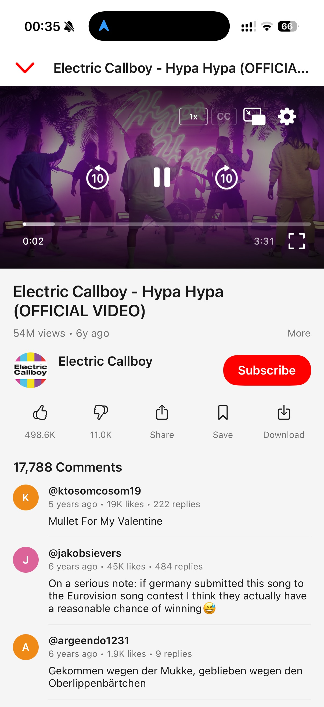
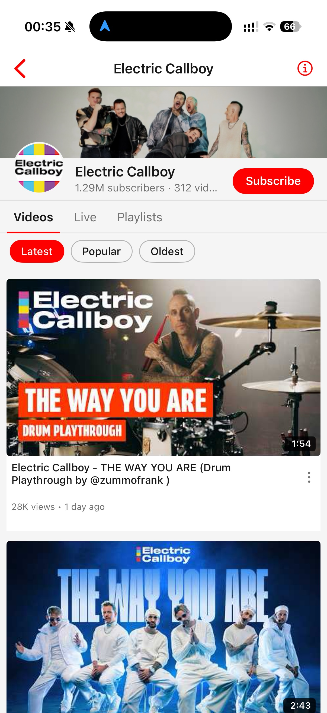
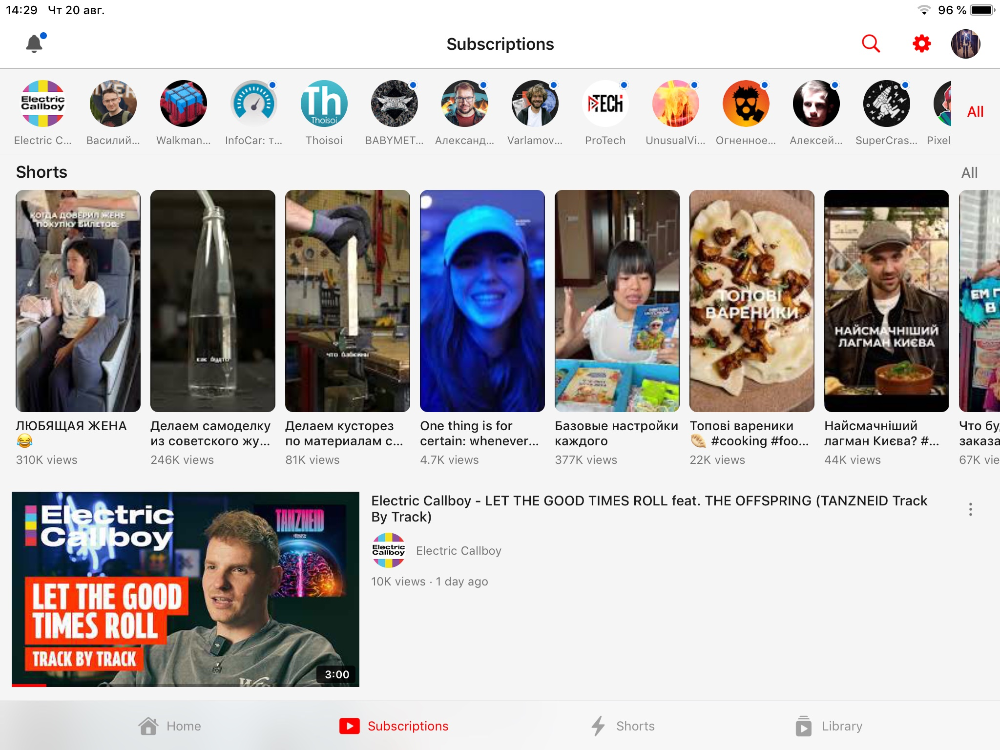

<div align="center">

# Opaline Legacy (iOS 9 / armv7)

<picture>
  <source media="(prefers-color-scheme: dark)" srcset="source/logo-dark.png">
  
</picture>

**A lightweight, native YouTube client. No ads, no tracking, no dependencies.**

**This branch is the iOS 9 downport — it runs on the iPad 3.**


[](LICENSE)

</div>

> ### What this branch is
>
> Upstream Opaline targets iOS 12. This is the downport that runs it on
> **armv7 / iOS 9.3.5** — the iPad 3 and its A5X, hardware two major
> architectures below anything the app was written for.
>
> It is not a cut-down version — the app is all here. A few things the
> hardware simply cannot do are switched off; they are listed under
> [Known Issues](#known-issues-and-limitations).
>
> **Two features were added here that upstream does not have**, because the
> hardware asks for them:
>
> - **[Hardware keyboard control](#hardware-keyboard)** — the iPad 3 era is the
>   era of the folio keyboard, and the app was entirely touch-driven
> - **[A local library](#local-library)** — subscriptions and watch history
>   that need no Google account, kept on the device
>
> <sub>Opaline was released as YTLite until August. It was renamed to avoid
> confusion with an unrelated tweak of the same name and is not related to it.</sub>

<div align="center">

<br>

<picture>
  <source media="(prefers-color-scheme: dark)" srcset="screenshots/app/iphone/dark/recommendations.jpeg">
  
</picture>
<picture>
  <source media="(prefers-color-scheme: dark)" srcset="screenshots/app/iphone/dark/player.jpeg">
  
</picture>
<picture>
  <source media="(prefers-color-scheme: dark)" srcset="screenshots/app/iphone/dark/channel.jpeg">
  
</picture>
<picture>
  <source media="(prefers-color-scheme: dark)" srcset="screenshots/app/iphone/dark/subscriptions.jpeg">
  
</picture>

<sub>Screenshots follow your GitHub theme — the app supports both light and dark mode.</sub>

</div>

## Why

When Google dropped support for the official YouTube app on older devices, there was no way to watch videos properly. Browsers capped quality at 360p — and even that barely ran. Opaline was born to restore what was lost: high-quality playback on hardware that still works fine, just ignored by Google — a focused, lightweight client that does one thing well.

## Features

- **Video playback** — up to **1080p** on the iPad 3. 1080p is watchable on an A5X with the same ~8s start as 720p, so it stays selectable while Auto clamps to 720p for bandwidth rather than for the hardware. AV1 and 2K/4K need decode hardware this era does not have
- **Shorts** — a native full-screen viewer with vertical swiping, likes, comments and sharing. Tapping a short anywhere carries that list into the viewer, and the whole tab can be switched off. **Preloading the next short is disabled on iOS 9**: what upstream treats as a cheap resolve is a full composition build here, so a swipe pays a fresh resolve (~2.1–2.6s) instead of the tap paying ~6.0s for speculative ones
- **Kids content** — plays videos the standard API sources refuse, via a dedicated playback source
- **Offline downloads** — save a video to the device and watch it with no network. Its page comes along: thumbnail, description, like counts and the comments as of the moment you saved it. Settings → Downloads picks the quality, how many comments and which subtitle languages travel with it, and a video that plays dubbed in your language is saved dubbed
- **Pinch to zoom** — fill the screen in fullscreen with a pinch, or turn on Zoom to Fill to do it automatically
- **Background audio** — continue listening with the screen off
- **Media controls** — play/pause and next/previous video from Control Center, the lock screen and headphones
- **Picture-in-Picture** — watch while using other apps *(compiled but unavailable on an A5X — see [Known Issues](#known-issues-and-limitations))*
- **SponsorBlock** — skip sponsored segments automatically
- **Return YouTube Dislike** — see dislike counts again
- **Audio tracks** — switch dubbed audio on multi-language videos, or start videos dubbed in your language automatically; AI auto-dubs are marked "(AI)"
- **Subtitles** — full subtitle/caption support with VTT parsing
- **13 languages** — localized interface, with video titles/search/feeds following your language (see [Localization](#localization))
- **Search & browse** — live suggestions, recent-search history, filters (sort, upload date, type, duration), channel pages, playlists
- **Smart home feed** — endless recommendations with category chips read from your feed's shelves
- **Subscriptions** — follow channels with a local subscription feed, **with or without a Google account** (see [Local library](#local-library))
- **Notifications** — a bell in the top bar collects app news and new-version announcements, with the full release notes in the message; system notifications are optional and everything still collects in-app if you decline
- **Watch history** — progress indicators and resume-where-you-left-off, synced across devices when signed in and **kept on the device when not** (see [Local library](#local-library))
- **Autoplay** — automatically play the next related video, with replay, previous and next offered when one ends
- **Auto theme** — scheduled hours on iOS 9 (the system has no dark mode to follow); manual override available
- **Made for old hardware** — thumbnails and channel details are fetched and decoded a few at a time rather than all at once, which is what keeps scrolling smooth on an A5X
- **Your layout** — pick the tab the app opens on, force the icon light or dark, and browse settings as a nested menu instead of one long list
- **Hardware keyboard** — drive the whole app from a folio keyboard: transport, seeking, a focus ring for every list, and search. [Full shortcut list](#hardware-keyboard)
- **Local library** — subscriptions and watch history with no Google account, stored on the device. [What it does](#local-library)

<div align="center">

<picture>
  <source media="(prefers-color-scheme: dark)" srcset="screenshots/app/ipad/dark/player.jpeg">
  
</picture>

<sub>Native iPad layout — player and related videos side by side.</sub>

</div>

<details>
<summary><b>More screenshots</b></summary>
<br>
<div align="center">

<picture>
  <source media="(prefers-color-scheme: dark)" srcset="screenshots/app/iphone/dark/settings.jpeg">
  
</picture>

<picture>
  <source media="(prefers-color-scheme: dark)" srcset="screenshots/app/ipad/dark/recommendations.jpeg">
  
</picture>

<picture>
  <source media="(prefers-color-scheme: dark)" srcset="screenshots/app/ipad/dark/channel.jpeg">
  
</picture>
<picture>
  <source media="(prefers-color-scheme: dark)" srcset="screenshots/app/ipad/dark/subscriptions.jpeg">
  
</picture>

</div>
</details>

## Hardware keyboard

Upstream is touch-only. On an iPad 3 the keyboard is usually attached, so the
whole app is drivable from it — and every command is **modifier-less where it
can be**, because a bare key still reaches an app on iOS 9.

**Anywhere**

| Key | Action |
|---|---|
| `/` · `⌘F` · `⌘/` | Search — three ways in, because which one you reach for depends on the keyboard |
| `Space` · `K` | Play/pause whatever is playing |
| `F` | Fullscreen, or restore a minimized player |
| `X` | Stop the player |
| `Esc` · `Backspace` | Close / back out |
| `⌘1` … `⌘4` | Switch tab by visible position — Shorts is optional, so the bar renumbers itself when it is off |

**In a list, grid or the channel bar** — a focus ring, so you can browse without touching the screen

| Key | Action |
|---|---|
| `↑` `↓` (`←` `→` in a grid) | Move focus — pressing down on a fresh feed starts at the top |
| `Return` | Open the focused item |
| `Q` | Queue the focused video — on an empty queue it opens and starts minimized, so you can keep browsing |
| `Tab` · `⇧Tab` | Next / previous section |
| `⌘↑` · `⌘↓` | Jump to top / bottom |
| `PageUp` · `PageDown` | Page through |

**On the watch screen**

| Key | Action |
|---|---|
| `Space` · `K` | Play/pause |
| `←` `→` | Seek |
| `J` · `L` | Seek back / forward by a fixed step |
| `0`–`9` | Jump to that tenth of the video |
| `↑` `↓` | Volume |
| `N` · `]` / `P` · `[` | Next / previous video — the bracket pair sits together and leaves the media keys meaning seek |
| `M` | Mute |
| `F` | Fullscreen |
| `,` · `.` | Slower / faster |
| `Q` | Queue |
| `Esc` · `Backspace` | Close the player |

**In Shorts**: `↑` `↓` move between shorts, `Space` plays and pauses.

While a text field has the keyboard, only modified commands survive — otherwise
typing "j" into the search bar would seek the player. `Backspace` deletes a
character there rather than dismissing the player.

## Local library

Everything account-shaped in upstream Opaline is a round-trip to InnerTube, so
signed out you got an empty state and nothing else: no subscriptions feed, no
watch history, no channel pages, and a subscribe button constructed disabled so
it could not even be tapped. This branch gives the app a usable library with no
Google account — **local when signed out, account when signed in**. There is no
merging, no two-way sync and no import; the two libraries never mix.

- **Subscriptions** — subscribe from any video's menu or a channel page. The
  feed is assembled on the device from each channel's public Atom feed,
  windowed to the last 30 days, or the newest 40 videos if that window is
  thinner than that — a quiet subscription list should not read as an empty
  screen. Subscribing captures the channel's name and avatar at the moment you
  tap, because signed out there is nothing to enrich a bare channel id with
  afterwards.
- **Channel pages** load anonymously over the WEB browse — the same request the
  app already made to enrich channels, read by the same parser. "Channel
  unavailable" is retired.
- **Watch history** is recorded from the playback path rather than the
  watchtime tracker, which never starts without an account. That also restores
  **resume-where-you-left-off for anonymous users**, silently broken until now.
  History is flushed synchronously when the app goes to the background, which
  is what makes a watch survive the jetsam an iPad 3 takes routinely while
  suspended.
- **Shorts are off in Subscriptions by default** — that screen is for the
  videos of channels you chose. With it off the feed reads the channel's
  long-form Atom feed, so short-form is excluded at the source rather than
  filtered out afterwards. Turn it on in **Settings → Shorts**.

**Settings → Library** shows what is stored (`N channels · M videos`) and lets
you turn history recording off, cap it at 100 / 500 / 1000 entries (default
500), clear either store, or export your subscriptions as JSON. Signing in
switches to your account's library and deletes nothing.

Both stores live in `Application Support/LocalLibrary/` behind a versioned
envelope. The file layer distinguishes "no file" from "file present but
undecodable" and refuses to overwrite the latter — this is your only copy.

## Installation

This branch has no releases — **there is no IPA to sideload**, and iOS 9 devices
cannot run a modern sideloading client anyway. You need a **jailbroken armv7
device on iOS 9.3.x** (developed against an iPad 3 on 9.3.5), and you install a
package you build yourself.

Building it needs a Linux machine rather than Xcode; the scripts are in
`scripts/legacy/` and the short version is under
[Building](#building). `deploy.sh` produces the `.deb`, serves it over USB, and
prints the source to add in **Cydia → Sources**. Nothing is published anywhere.

## Known Issues and Limitations

Everything below is specific to this branch unless marked otherwise.

- **Picture-in-Picture does not work on an A5X.** It is compiled in, but the
  system will not start it on this hardware. Background audio works
- **AV1, 2K and 4K are unavailable** — no decode hardware exists on this device.
  1080p AVC is the ceiling, and it is a comfortable one
- **Shorts do not preload.** A swipe to the next short pays its own resolve
  (~2.1–2.6s). See [Features](#features) for why preloading was removed rather
  than tuned
- **Starting a video takes ~8 seconds** at 720p or 1080p. The stream is
  assembled on-device into a synthesized progressive MP4 and served to
  `AVPlayer` over a loopback HTTP server, because iOS 9's `AVPlayer` will not
  take the formats YouTube serves directly
- A long **main-thread freeze** (~57s) has been seen occasionally and is not
  yet fixed
- *(upstream)* Playback speeds above 2x may cause issues
- *(upstream)* Comments are read-only — you can browse and sort them and open
  replies, but not post, reply or like
- *(upstream)* Notification delivery is scheduled by iOS at its own discretion —
  expect news within hours of publication, not minutes

## Localization

The interface follows your system language by default and can be overridden in **Settings → Language**. The content language (video titles, search, feeds — translated server-side by YouTube, like the official app) follows the app language; the region can be set separately.

> [!NOTE]
> Wording follows the official YouTube app's own translations wherever it has an equivalent string, but mistakes are still possible. If you spot a wrong or awkward translation — or want a language that isn't here — please [open an issue](../../issues) describing where it appears and what the correct wording should be.

<details>
<summary><b>Available in 13 languages</b></summary>
<br>

| | | | |
|---|---|---|---|
| `en` English | `ru` Русский | `uk` Українська | `de` Deutsch |
| `es` Español | `fr` Français | `it` Italiano | `ja` 日本語 |
| `pt` Português | `tr` Türkçe | `vi` Tiếng Việt | `zh-Hans` 简体中文 |
| `zh-Hant` 繁體中文 | | | |

</details>

## Playback Helper Server

Signed-in playback relies on a small companion service, and so does the Mobile Web source it falls back to. Preparing these streams requires evaluating JavaScript from YouTube's public player page — something devices of this era can't do on-device. The app delegates that single step to the helper server and receives the computed result back.

Since 14 August this covers more than it used to. Dubbed audio and videos made for kids are prepared this way, so if the service is unreachable, dubs quietly fall back to the original audio and kids videos won't play until it's back.

**What it sees:** no account data, no tokens, no cookies, no watch history — only the challenge strings taken from the public player code and the ID of the video being prepared. If you're inspecting traffic and wondering about requests to a non-YouTube host — that's this.

The server's source code will be published later so you can host your own instance and point the app at it (**Settings → Debug → Solver Server**).

## Bug Reports

If you encounter a bug, you can export debug logs directly from the app:

**Settings → Debug → Share Debug Log**

This generates a log file you can attach to your GitHub issue. The log includes timestamped playback, API, and caching events that help diagnose problems.

On this branch the app is installed to `/Applications` by Cydia, which makes it
a *system* app with no sandboxed data container — so its log is **not** under
`/var/mobile/Containers/`. It is at:

```
/var/mobile/Library/Caches/Logs/opaline.log
```

<details>
<summary><b>For developers</b></summary>

## Building

**This branch does not build in Xcode.** iOS 9 needs an old Swift compiler,
driven on Linux under [Darling](https://www.darlinghq.org/) and targeting
`armv7-apple-ios9.3`. Everything is in `scripts/legacy/`:

```bash
scripts/legacy/cold-boot.sh    # one-time: set up the toolchain
scripts/legacy/build.sh        # build
scripts/legacy/deploy.sh       # package, serve, install from Cydia
```

Upstream files are never edited to make them compile. Two are held out of the
build by `excluded-sources.txt`, and anything that compiles but cannot run on
iOS 9 is left in and switched off where it is chosen — which is what keeps
merges from upstream clean.

## Architecture

```
Opaline/
├── App/              Composition root: AppDelegate, DI wiring, tab bar
├── Core/             Shared kernel (features depend on it, never on each other)
│   ├── API/          YouTube Innertube API client
│   ├── Auth/         OAuth device-code flow
│   ├── Config/       URLs, UserDefaults keys, constants
│   ├── Transport/    HTTP abstraction + decorators
│   ├── Playback/     VideoSource contracts, sources, HLS machinery
│   ├── Services/     Caching, SponsorBlock, RYD, subtitles, watchtime
│   │   └── LocalLibrary/  Account-free subscriptions & watch history
│   ├── Keyboard/     Key command catalog, focus ring, press dispatch
│   └── Common/       Shared UI components & utilities
└── Features/         One vertical slice per feature
    ├── Channel/      Channel page with tabs
    ├── Home/         Home feed
    ├── Library/      Playlists & saved videos
    ├── Player/       Video player & watch page
    ├── Profile/      User profile
    ├── Search/       Search with suggestions
    └── Subscriptions/ Subscription feed
```

### Key Design Decisions

- **Zero external dependencies** — Networking via a custom `HTTPTransport` abstraction over `URLSession`, images via custom `ThumbnailImageView`, playback via `AVPlayer`
- **All UIKit, no SwiftUI** — Programmatic layout, no storyboards
- **iOS 9.3+ support** on this branch — No SF Symbols, no SwiftUI, no Combine
- **Manual JSON parsing** — `JSONSerialization` + dictionary traversal for YouTube Innertube API responses
- **Dependency injection** — `ServiceContainer` provides services; view controllers receive dependencies via initializers

### Playback Pipeline

Playback is built on a single `VideoSource` abstraction — each way of playing a video implements the same interface and owns both stream resolution and quality selection. `PlaybackFacade` just asks a factory for the configured source, calls `loadPlayback`, and hands the prepared `AVPlayerItem` to the player shell. The sources:

1. **Auto** *(default)* — Composite: tries Android VR first, transparently falls back to Mobile Web when a video fails to resolve or start.
2. **Android VR** — Streams via YouTube's Innertube API; adaptive formats (360p–1080p AVC, up to 4K AV1 on supported hardware) are converted from DASH SIDX byte ranges into an HLS playlist for native `AVPlayer`, with progressive/native-HLS fallbacks.
3. **Mobile Web** — Handles videos the Android VR client refuses (e.g. kids content). Stream URLs require solving JavaScript challenges from the player page; that step is delegated to the helper server (see above), everything else stays on-device.
4. **Progressive** — Direct 360p MP4 URL for the restricted case (e.g. server-side A/B experiments).

Quality selection is source-agnostic: the player UI simply renders whatever qualities the active source reports. Background audio is `AVAudioSession`-based and works across all sources.

**On this branch the last step differs.** iOS 9's `AVPlayer` will not take the
HLS playlists described above, so the selected streams are assembled on-device
into a synthesized progressive MP4 and served to the player over a loopback HTTP
server. That is what the ~8 second start time buys.

### Authentication

OAuth device-code flow: the app requests a device code → user enters it at google.com/device → tokens are stored in Keychain. Anonymous browsing is supported.

## Project Structure

| Component | Purpose |
|-----------|---------|
| `InnertubeClient` | YouTube API: browse, search, player, comments, subscriptions |
| `PlaybackFacade` | Selects a `VideoSource` via factory, loads it, and drives player setup |
| `VideoPlayerView` | Custom player UI with controls, gestures, PiP |
| `WatchViewController` | Watch page: player + metadata + comments + related |
| `AppCache` | Dual-layer cache (memory + disk) with TTL |
| `SponsorBlockController` | SponsorBlock API integration |
| `ThemeManager` | App-wide theming (dark/light) |

## Contributing

1. Fork the repository
2. Create a feature branch (`git checkout -b feature/my-feature`)
3. Commit your changes (`git commit -am 'Add my feature'`)
4. Push to the branch (`git push origin feature/my-feature`)
5. Open a Pull Request

Please follow the existing code style. SwiftLint is configured and runs as a build phase.

</details>

## Support

If Opaline keeps your old device alive, you can support development:

<a href="https://buymeacoffee.com/verback2308" target="_blank" rel="noopener noreferrer"></a>

## Credits

- [SponsorBlock](https://github.com/ajayyy/SponsorBlock) — crowdsourced API for skipping sponsored segments
- [Return YouTube Dislike](https://github.com/Anarios/return-youtube-dislike) — community-maintained dislike count data
- [yt-dlp](https://github.com/yt-dlp/yt-dlp) — invaluable reference for understanding YouTube's playback infrastructure
- [YouTubeLegacy](https://github.com/PoomSmart/YouTubeLegacy) — inspiration for keeping YouTube alive on older devices

## Legal

This project is for educational and personal use. It is not affiliated with, endorsed by, or connected to Google or YouTube. Use at your own risk.

## License

[GNU General Public License v3.0](LICENSE) — any derivative work must also be released under GPLv3 with its full source code.
